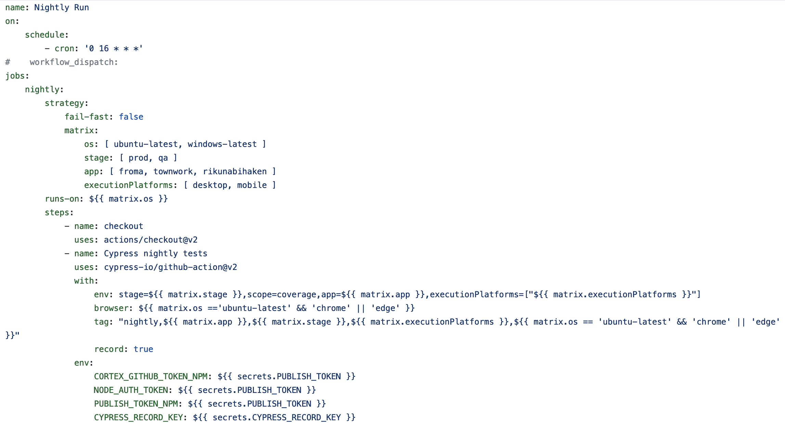
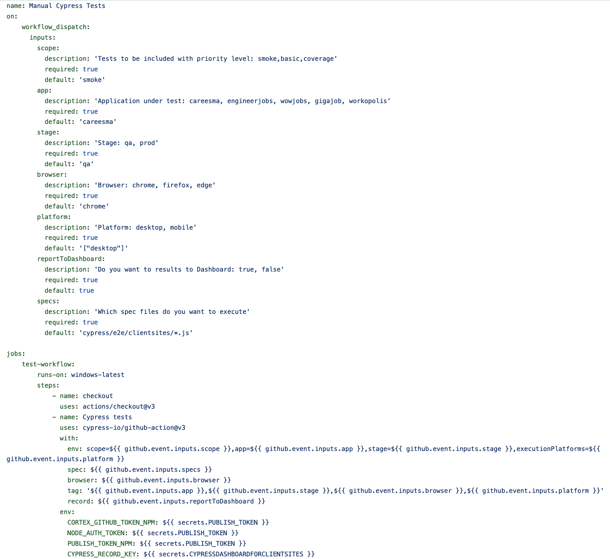
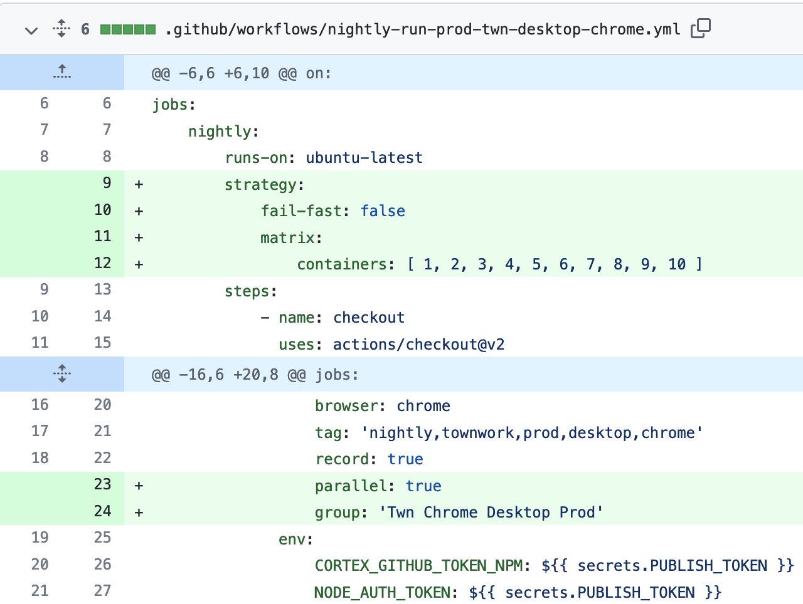

# Cortex Client Sites E2E Tests

- [Start Cypress](#Start_Cypress)
- [Parameters](#Parameters)
- [Execution on the Pipelines](#Execution_on_the_Pipelines)

## Start_Cypress
After setup, Cypress is ready to be executed. It can be started by jusr running from the command line:

```bash
  cypress
  
  // or if the alias is not recognized by the system, one of:
  node_modules/.bin/cypress
  npx cypress
```
There are 2 modes to start Cypress: Either run or open mode. 'Cypress open' starts a 'Cypress Runner'. On the runner, any spec file can be selected for execution.
The browser can also be selected. Run Cypress runs the tests on a terminal (headless mode). So, there is no way to see the browser. But the execution is
recorded as a video. It can be seen if needed.

```bash
  cypress open
  cypress run  
```

## Parameters

Some parameters can be added to commands to customize the executions:

-   To run a specific spec file instead of the whole suite (regex and list supported)
```bash
--spec "**/Filters.js, **/Results.js"
--spec $(git diff --name-only origin/main -- cypress/e2e)
```

-   To change the browser settings
```bash
--browser chrome --headed
```

- To use another config file rather than default
```bash
--config-file ./my_custom_cypress.json
```

- Base Url
```bash
CYPRESS_BASE_URL=https://townwork.net/ cypress 
```

- Other environmental parameters
```bash
--env scope=coverage,app=froma,stage=qa,executionPlatforms="[desktop,mobile]",

```
string parameters are passed without but arrays are with quotation marks. They can be passed either from 
console or github UI in one of the forms:
```bash
"[desktop,mobile]" 
'[desktop,mobile]' 
"['desktop', 'mobile']" 
'["desktop", "mobile"]'
```

Assigning in the yaml file is slightly different. Either direct assignment or matrix usage should be without quotation 
marks. (ie [‘desktop’])

## Execution_on_the_Pipelines

Some examples:



